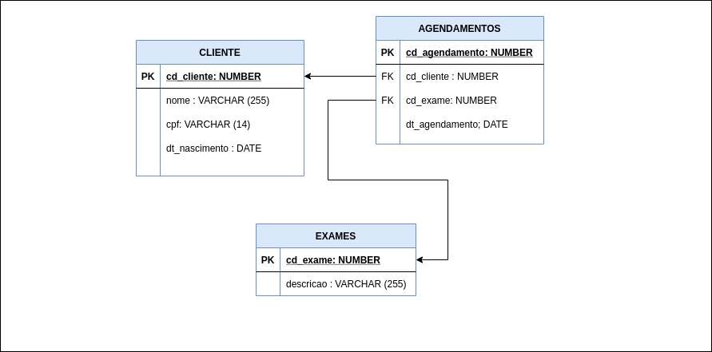

# Backend 

## Descrição 

O nosso desafio de backend do **CODIND DOJO** será em criar uma api restfull para realização de agendamentos de consultas e exames online, para tal o usuário precisará ter um cadastro de cliente na base de dados, selecionar um exame e informar data e hora desejado.

## Regras de Negócio

- Cliente precisa estar cadastrado na base de dados para realizar o agendamento;
- Caso o cliente não exista em base, deverá ser feito o cadastro antecipadamente;
- Não será possível realizar agendamento de mais de 2 pacientes para o mesmo exame na mesma data e hora;
- O cadastro de cliente deverá ter os campos: Nome, CPF e Data de Nascimento;
- Não poderá ser cadastrado mais de um cliente para o mesmo CPF;

  

## Features

- Deverá haver um endpoint para listagem dos exames disponíveis para agendamento, exibindo apenas nome do exame e id;
- Deverá haver um endpoint para criação de um cliente;
- Deverá haver um endpoint para atualização de um cliente;
- Deverá haver um endpoint para exclusão de um cliente;
- Deverá haver um endpoint para busca de um cliente baseado no seu cpf;
- Deverá haver um endpoint para listagem de todos os clientes cadastrados;
- Deverá haver um endpoint para edição de um agendamento realizado, apenas dia e hora poderão ser editados;
- Deverá haver um endpoint para exclusão de um agendamento realizado;

## Requisitos

- Java 11. Spring boot 2.x. para o backend;
- Testes unitários Junit 4.x.;
- Spring Data;
- JPA;

## Modelo de dados

## Getting Started

A estrutura inicial do projeto foi criada utilizando a plataforma **spring initializr** utilizando esta configuração [AQUI](https://start.spring.io/#!type=maven-project&language=java&platformVersion=2.4.4.RELEASE&packaging=jar&jvmVersion=11&groupId=com.devinhouse&artifactId=codindojo&name=backend&description=Backend%20desafio%20coding%20dojo&packageName=com.devinhouse.codindojo&dependencies=web,data-jpa,h2)

### Documentação de referência 

* [Official Apache Maven documentation](https://maven.apache.org/guides/index.html)
* [Spring Boot Maven Plugin Reference Guide](https://docs.spring.io/spring-boot/docs/2.4.4/maven-plugin/reference/html/)
* [Create an OCI image](https://docs.spring.io/spring-boot/docs/2.4.4/maven-plugin/reference/html/#build-image)
* [Spring Web](https://docs.spring.io/spring-boot/docs/2.4.4/reference/htmlsingle/#boot-features-developing-web-applications)
* [Spring Data JPA](https://docs.spring.io/spring-boot/docs/2.4.4/reference/htmlsingle/#boot-features-jpa-and-spring-data)

### Guias 

Os guias a seguir ilustram como usar alguns recursos concretamente:

* [Building a RESTful Web Service](https://spring.io/guides/gs/rest-service/)
* [Serving Web Content with Spring MVC](https://spring.io/guides/gs/serving-web-content/)
* [Building REST services with Spring](https://spring.io/guides/tutorials/bookmarks/)
* [Accessing Data with JPA](https://spring.io/guides/gs/accessing-data-jpa/)

### Acessando o console do H2

O banco de dados do nosso backend inicializa em memória e pode ser acessado neste endereço aqui http://localhost:8080/h2-console . O usuário e senha são os definidos no arquivo application.properties dentro no nosso projeto.